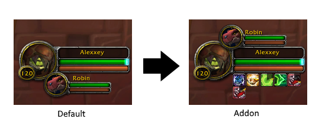

    

 

# PlayerFrameAuras
A <i>lightweight</i> World of Warcraft addon that provides auras on the playerframe by mimicking the Blizzard auras on targetframe.

 

    

## Who is PlayerFrameAuras for
PlayerFrameAuras are for those who want the player auras moved from its original location to a more <i>visible</i> location, without the need for extensive addons that changes the blizzard default UI. PlayerFrameAuras is also good for those who just wants the player auras to be consistent with the target frame auras.

 

## Customization
The display of the auras can be customized.

- Hide the default blizzard auras in the top right corner
- Position auras on top or bottom of playerframe
- Change aura size and spacing
- Filter auras based on type:
  - Buff
  - Debuff
  - Can be canceled
  - Cannot be canceled
  - Cast by you
  - Cast by others on you

 
